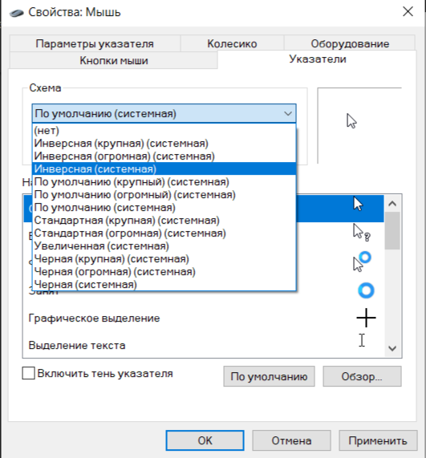

# Лабораторная работа №1: Настройка параметров рабочей среды пользователя в ОС Windows

## Цель:
Научиться выполнять различные настройки параметров рабочей среды пользователя.

## Методические указания и задания:

### I. Настройка рабочего стола

1. **Выберите фоновый рисунок рабочего стола.**
   - 

2. **Измените цветовую схему.**
   - 

3. **Настройте оформление окон Windows и их элементов.**
   

4. **Подключите и настройте заставку экрана.**
  

5. **Сохраните пакет настроек как тему оформления Windows.**
  

6. **Определите папку сохранения темы пользователя.**
  C:\Users\[Ангелина]\AppData\Local\Microsoft\Windows\Themes

### II. Настройка звуков

1. **Выберите схему звукового оформления.**


2. **Настройте программные события, выбрав подходящие звуки.**
  

3. **Сохраните новые настройки как звуковую схему.**
 

4. **Определите папку сохранения звуковой схемы пользователя.**
   C:\Users\[Ангелина]\AppData\Local\Microsoft\Windows\Themes.

### III. Настройка параметров мыши

1. **Установите максимальную скорость двойного щелчка на вкладке "Кнопки".**
 

2. **Выберите инверсную схему указателей, настройте виды указателя и включите тень указателя.**
  
  

3. **Сохраните настройки как схему указателей.**
 

4. **Определите папку сохранения схемы пользователя.**
   C:\Windows\Cursors

5. **Настройте скорость движения указателя выше среднего и отобразите след указателя мыши.**


6. **Установите поворот колесика мыши на один щелчок на 7 строк.**


### IV. Настройка панели задач

1. **Переместите панель задач в верхнюю часть экрана.**
  

2. **Включите автоматическое скрытие панели задач.**


3. **Настройте группировку задач при заполнении панели задач.**


4. **Скрывайте значки уведомлений для громкости и сети.**


5. **Настройте отображение недавно использовавшихся программ (5 штук).**
  

6. **Закрепите программу Paint на панели задач.**
 

7. **Уберите часы с панели задач.**

### V. Настройка главного меню Windows

1. **Добавьте новый элемент в главное меню (папку с ярлыками программ).**


2. **Создайте элемент "Мои программы" с ярлыками для запуска калькулятора и блокнота.**
  

### VI. Настройка элементов автозагрузки

1. **Разместите ярлыки для запуска MS Word и MS Excel в папке автозагрузки.**
  

### VII. Настройка клавиатуры

1. **Закройте языковую панель на панели задач.**
   

2. **Верните языковую панель обратно через настройки панели управления.**


3. **Установите сочетание клавиш Ctrl+Shift для смены раскладки клавиатуры.**
   

### VIII. Настройка свойств папок

1. **Выберите вариант обзора папок (открывать каждую папку в отдельном окне).**
  

2. **Установите параметры отображения (например, показывать расширения файлов).**
 

3. **Измените значок для любой папки.**
  

### IX. Выбор программ по умолчанию

1. **Назначьте MS Word программой по умолчанию для текстовых файлов (.txt).**
  

---

# Лабораторная работа №2: Работа в режиме командной строки

## Цель:
Изучить основы работы в командной строке, освоить команды для работы с файлами и каталогами.

## Теоретические сведения:

Командная строка позволяет:
- Запускать программы, службы, утилиты;
- Работать с файловой системой;
- Конфигурировать устройства;
- Настраивать ОС.

## Основные команды:

- **ATTRIB**: изменение атрибутов файлов;
- **CD**: смена текущего каталога;
- **COPY**: копирование/объединение файлов;
- **DEL/ERASE**: удаление файлов;
- **DIR**: просмотр списка файлов/каталогов;
- **MD/RD**: создание/удаление каталогов;
- **MOVE**: перемещение файлов;
- **REN**: переименование файлов;
- **TREE**: отображение структуры каталогов.

## Задания:

1. **Оформить отчет с результатами выполнения заданий (скриншоты).**
   

2. **Составить конспект используемых команд с пояснениями.**
   ### Навигация
   Команда | Описание | Пример |
 |---------|----------|--------|
 | `CD` | Смена текущего каталога | `CD C:\Folder` |
 | `CD..` | Переход в родительский каталог | `CD..` |
 | `CD\` | Переход в корневой каталог | `CD\` |

### Работа с каталогами
 | Команда | Описание | Пример |
 |---------|----------|--------|
 | `DIR` | Просмотр содержимого каталога | `DIR /A` |
 | `MD` | Создание каталога | `MD NewFolder` |
 | `RD` | Удаление каталога | `RD OldFolder` |
 | `TREE` | Отображение структуры каталогов | `TREE /F` |

### Работа с файлами
 | Команда | Описание | Пример |
 |---------|----------|--------|
 | `COPY` | Копирование файлов | `COPY file.txt C:\Backup\` |
 | `XCOPY` | Расширенное копирование | `XCOPY /S /E source dest` |
 | `MOVE` | Перемещение файлов | `MOVE file.txt C:\New\` |
 | `REN` | Переименование файлов | `REN old.txt new.txt` |
 | `DEL` | Удаление файлов | `DEL file.txt` |
 | `TYPE` | Просмотр содержимого файла | `TYPE file.txt` |

### Атрибуты файлов
 | Команда | Описание | Пример |
 |---------|----------|--------|
 | `ATTRIB` | Изменение атрибутов | `ATTRIB +H +S file.txt` |

**Флаги:**
- `+H`: Скрытый файл
- `+R`: Только для чтения
- `+S`: Системный файл
- `+A`: Архивный файл

### Системные команды
 | Команда | Описание | Пример |
 |---------|----------|--------|
 | `CLS` | Очистка экрана | `CLS` |
 | `HELP` | Справка по командам | `HELP DIR` |
 | `VER` | Версия Windows | `VER` |
 | `DATE` | Текущая дата | `DATE /T` |
 | `TIME` | Текущее время | `TIME /T` |

### Сетевые команды
 | Команда | Описание | Пример |
 |---------|----------|--------|
 | `PING` | Проверка соединения | `PING google.com` |
 | `IPCONFIG` | Сетевые настройки | `IPCONFIG /ALL` |
 | `TRACERT` | Трассировка маршрута | `TRACERT google.com` |

### Полезные сочетания

- `TAB`: автодополнение имен файлов
- `↑/↓`: перебор предыдущих команд
- `> file.txt`: перенаправление вывода в файл
- `Ctrl+C`: прерывание выполнения команды

3. **Выполнить практические задания с использованием команд (например, создание каталогов, копирование/перемещение файлов, настройка атрибутов).**
  

---

# Лабораторная работа №3: Установка операционной системы

## Цель:
Получить навыки установки ОС Windows.

## Методические указания:

1. **Подготовьте загрузочный носитель с дистрибутивом ОС Windows.**
  

2. **Выполните установку ОС с учетом выбора раздела диска, формата файловой системы и ввода ключа продукта.**
   - 

## Контрольные вопросы:

1. **Ответьте на вопросы об этапах установки ОС, выборе параметров BIOS/UEFI и типах лицензий Windows.**
   # Установка Windows: BIOS/UEFI и лицензии

## 1. Этапы установки

### Подготовка

- **Создать загрузочную флешку**:
  - Используйте **Media Creation Tool** или **Rufus**.

- **Настроить BIOS/UEFI**:
  - **Режим загрузки**: UEFI (для Windows 10/11)
  - **Secure Boot**: Enabled (для Windows 11)
  - **Boot Order**: USB → SSD/HDD

### Установка

- **Разметка диска**:
  - **Системный раздел**: 100-500 МБ (UEFI)
  - **Основной раздел**: NTFS

- **Пропустить ввод ключа** (активировать позже)
- **Создать пользователя**

## 2. Критичные настройки BIOS/UEFI

| Параметр       | Рекомендация                     |
|----------------|----------------------------------|
| **Boot Mode**  | UEFI                            |
| **Secure Boot**| Enabled (для Windows 11)        |
| **TPM**        | Enabled (для Windows 11)        |
| **AHCI Mode**  | Для SSD                          |

## 3. Типы лицензий

- **Retail**: для розницы (переносимая)
- **OEM**: для производителей (привязана к железу)
- **Volume**: корпоративная (KMS)

## 4. Частые проблемы

### "Windows cannot be installed"

- **Сменить режим диска**: RAID → AHCI
- **Пересоздать разделы**

### Не видит флешку

- **Проверить формат**: FAT32 для UEFI
- **Для Windows 11 обязательно**: TPM 2.0 + Secure Boot + UEFI


---

# Лабораторная работа №4: Работа с виртуальными машинами

## Цель:
Освоить навыки работы с виртуальными машинами (VirtualBox или VMware).

## Методические указания:

1. **Установите виртуальную машину, настройте параметры оборудования, установите ОС внутри виртуальной машины и проверьте её работоспособность.**
  
  
  

## Контрольные вопросы:

1. **Ответьте на вопросы о преимуществах виртуализации, отличиях гипервизоров первого и второго типа и способах настройки сети для виртуальных машин.**
  # Виртуализация: преимущества, гипервизоры и сети

## 1. Преимущества виртуализации

- **Экономия ресурсов**: Запуск нескольких ВМ на одном физическом сервере.
- **Изоляция**: Сбои в одной ВМ не влияют на другие.
- **Тестирование**: Безопасная среда для экспериментов.
- **Миграция**: Перенос ВМ между хостами без простоя.
- **Резервирование**: Снимки (snapshots) состояния ВМ.

## 2. Типы гипервизоров

### Type 1 (Аппаратные)

- **Работают напрямую на железе** (без ОС).
- **Примеры**: VMware ESXi, Microsoft Hyper-V, Xen, KVM.

**Плюсы:**
- Высокая производительность.
- Лучшая безопасность.

**Минусы:**
- Требуют выделенного сервера.

### Type 2 (Программные)

- **Работают поверх ОС хоста**.
- **Примеры**: VirtualBox, VMware Workstation, Parallels.

**Плюсы:**
- Простота использования.
- Не требуют спецоборудования.

**Минусы:**
- Низкая производительность.
- Ограниченные возможности.

## 3. Настройка сетей для ВМ
   Режим       | Описание                         | Использование                     |
 |--------------|----------------------------------|------------------------------------|
 | **NAT**      | ВМ используют NAT хоста          | Доступ в интернет                 |
 | **Host-only**| Изолированная сеть между ВМ и хостом | Тестирование без доступа наружу   |
 | **Bridge**   | ВМ получают IP из физической сети | Публичные сервисы                 |
 | **Internal** | Сеть только между ВМ              | Закрытые кластеры                 |

### Пример для VirtualBox:

```shell
VBoxManage modifyvm "VM_name" --nic1 bridged --bridgeadapter1 eth0
VBoxManage modifyvm "VM_name" --nic2 nat
